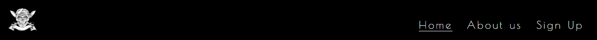
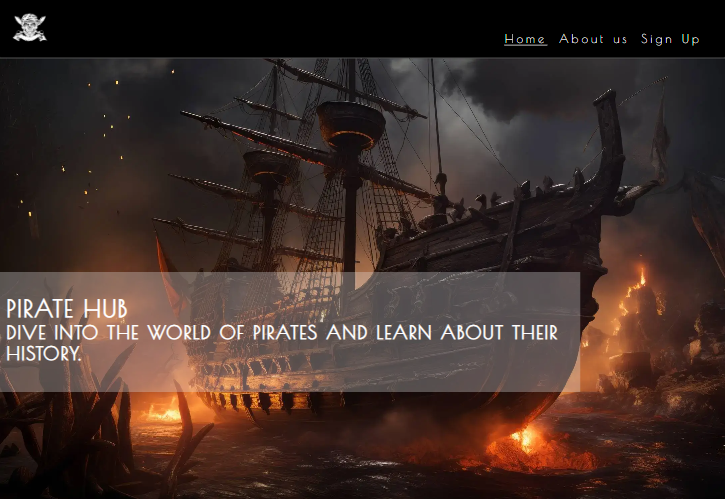
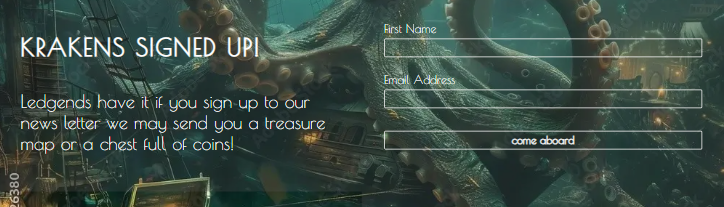
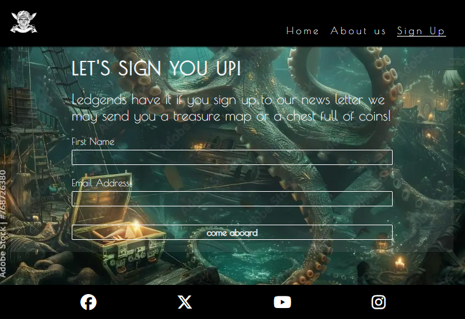
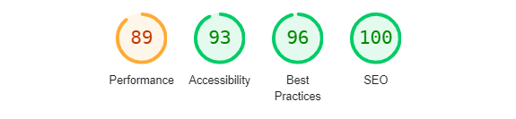

# Pirate Hub

The Pirate Hub website is an online destination for everything related to pirates. Users of  our site can share their enthusiasm and passion and engage in presuing there hobby while they dive into the thrilling and adventurers world of pirates.

Users can also sign-up to our newsletter and get inform on our future activities

## Features

- Navigation Bar
  
  - Logo Link: The Pirate Hub logo on the left side of the nav bar, which also acts as a link to the home page.
  - The other navigation links are at the right : Home, About us and Sign up that navigates to other pages of Pirate Hub.
  ##
  
  ##

- The Header

  - The first element in the header is the hero image which contain an image of a pirate ship.
  - Then thereb is a text with the name of the site.
  - There is also a message which provide the user with clear information about who this site is for.
  ##
  
  ##

- The About-us Section

  - This section of the homepage contain a brief text about the site.
  - This text give a welcome message to the user along with an overall picture of what to expext on this site.
  - This section also contain a clickable text which will sent the user to the about us page.
  ##
  
  ##

- The Sign-up Section

  - The sign-up section contain a CTA and a sign-up form
  - This form collect information about the user, (their name and email address).
  - This section gives the users a chans to sign-up to the news letter and be part of pirate hub community.
  ##
  
  ##

- The Footer

  - The footer clickable contains social-media icons. 
  - These social media links give a chans to our users to be able to connect with us on social media.
  ##
  

  ##
- About Us Page
  - A seprate page with a clickable link in the nav-bar
  - This page give the user a more in dept discribtion about the website
  ## 
  

  ##
- Sign Up Page
  - This page can be accessed from the nav-bar
  - The sign-up page contain a CTA and a sign-up form
  - This form collect information about the user, (their name and email address).
  - This page is dedicated to give the users a chans to sign-up to the news letter and be part of pirate hub community.
  ##
  

## Testing 

- I've tested that this website works on different browsers.
- I confirmed that this website functions well, looks good on different screen size and is responsive.
- I confirmed that all the links on this website such as the links in the navbar (logo, homepage, about-us, sign-up) and the social media links in the footer (Facebook, X, youtube, instagram) works.
- I've confirmed that the sign-up form functions as it should.
- I confirmed that all texts on the website is readable.

### Bugs

#### un-Solved bugs

- I haven't encountered any technical bugs during the project, exept the fact that the texts background of the about section and sign up section on the homepage overlaps othe areas as the screen changes.(which is not fixed yet).

### Vlidator Testing

- HTML
  - No errors were found when testing the html code with the official (W3C) validator.
- CSS
  - No errors were spoted when passing trough the official (jigsaw) validator.
- Accessibility
  - I have confirmed that the font and colors were easy to read and the images were suitable to the website and everything were accessable by running the site trough lighthouse in devtools.
  #
  
  

## Deployment

  - This site eas deployed to GitHub pages. The steps to deploy are as follows:
    - in the github repository navigate to the setting tab.
    - From the source section drop-down menu select the master branch.
    - Once the master branch has been selected, the page will provide the link to the live website.

  Here is the live website: [Pirate Hub](https://ngisng.github.io/Pirate_Hub_finale/index.html) 

## Credits

  #### Content
  - The code to make the social media links was taken from loverunning project.
  #### Media
  - The images were taken from the adobe website.

